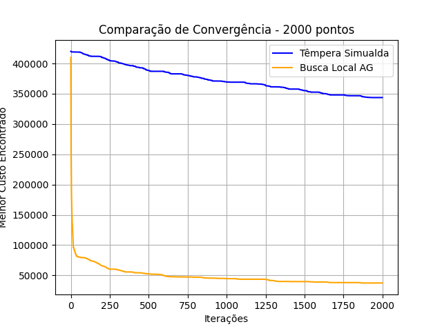

# Comparação de Algoritmos para o Problema do Caixeiro Viajante (TSP)

Este projeto tem como objetivo comparar o desempenho de dois algoritmos para resolução do Problema do Caixeiro Viajante (TSP - Travelling Salesman Problem):

- **Têmpera Simulada (Simulated Annealing)**
- **Busca Local Aleatória com Trocas (AG)**

## Funcionalidades

- Geração de instâncias aleatórias com diferentes números de pontos.
- Execução dos algoritmos de otimização.
- Salvamento de gráficos de convergência individuais e comparativos.
- Exportação de resultados para arquivos `.txt` e `.xlsx`.

## Algoritmos Implementados

### Têmpera Simulada

A Têmpera Simulada é um algoritmo inspirado no processo de resfriamento de metais, aceitando soluções piores com certa probabilidade para escapar de mínimos locais. Sua principal vantagem é a **rapidez de execução**, especialmente em instâncias menores, uma vez que explora eficientemente o espaço de soluções.

Parâmetros ajustáveis:
- Temperatura inicial e final
- Fator de resfriamento (alpha)
- Número máximo de iterações

Embora rápida, a Têmpera Simulada apresenta **maior custo computacional** em todas as instâncias, devido ao grande número de iterações necessárias para encontrar soluções satisfatórias, especialmente em comparação com o Algoritmo Genético.

### Busca Local AG

O Algoritmo Genético de Busca Local é um método que tenta melhorar a solução trocando duas cidades de lugar, mantendo a troca somente se ela reduzir o custo total do percurso. Este algoritmo tende a ser **mais eficiente em termos de custo computacional**, pois, embora envolva uma maior quantidade de tempo, as soluções são encontradas de forma mais gradual e com menor custo por iteração.

## Comparação Gráfica de Desempenho

Abaixo está um exemplo de gráfico comparando a evolução do custo ao longo do tempo para os dois algoritmos, perceba como para 2000 pontos o custo da Têmpera Simulada é quase 10 vezes maior que o da Busca Local AG:



## Estrutura de Arquivos Gerados

- `resultados_tsp.txt`: resumo dos custos e tempos de execução dos algoritmos.
- `comparacao_algoritmos_tsp.xlsx`: tabela com os mesmos dados em formato planilha.
- Pastas com gráficos de convergência e comparações:
  - `graficos_tsp/Têmpera_Simualda/`
  - `graficos_tsp/Busca_Local_AG/`
  - `comparacao_graficos_tsp/`

## Dependências

- numpy
- matplotlib
- pandas

Você pode instalar as dependências com:

```bash
pip install numpy matplotlib pandas
```

## Execução

Para rodar o experimento completo:

```bash
python tsp_main.py
```

